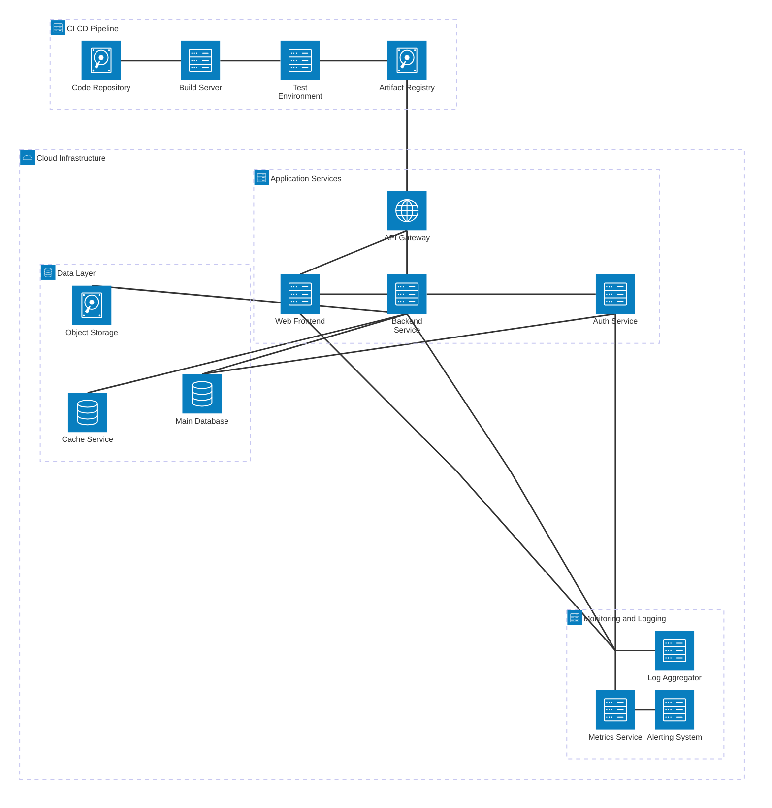

## Fixes Applied to the CI/CD Architecture Diagram

1. **Fixed special characters in group labels**:
   - Changed `CI/CD Pipeline` to `CI CD Pipeline` (removed slash)
   - Changed `Monitoring & Logging` to `Monitoring and Logging` (removed ampersand)
   - Changed monitoring group ID from `monitoring` to `monitoring_system` to match pattern

2. **Fixed incomplete connection syntax**:
   - Changed `monitoring_junction -- L:log_aggregator` to `monitoring_junction:R -- L:log_aggregator`
   - Changed `monitoring_junction -- B:metrics_service` to `monitoring_junction:B -- T:metrics_service`
   - All connections now have the proper format: `sourceId:sourcePosition -- targetPosition:targetId`

3. **Ensured proper entity IDs**:
   - All service and group IDs use underscores instead of hyphens or special characters
   - All labels avoid problematic characters like slashes (/), ampersands (&), etc.

4. **Optimized connections to prevent text overlaps**:
   - All connections use opposing sides (L-R or T-B)
   - Junction connections are properly formatted

The diagram should now render correctly without any syntax errors. 